<h1 align="center">Q-MoGraph—Quantised Motion Graph</h1>

<h2 align="center">Section 1: Video Results For Introduction</h2>

<h3 align="center"> Motion Sub-actions </h3> 
| Taking a step forward with left leg | Taking a step forward with right leg |
| ----------------------------------- | ----------------------------------- |
|  |  |

<h3 align="center"> Sequential Actions </h3> 
| Action 1| Action 2| Combination of Actions using Transformer| Concatenation of Actions
| ----------------------------------- | ----------------------------------- |
| 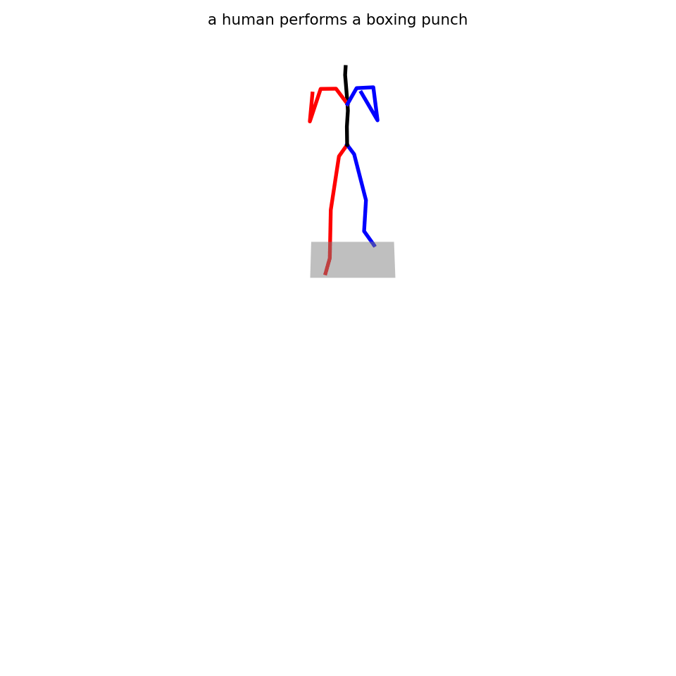 | 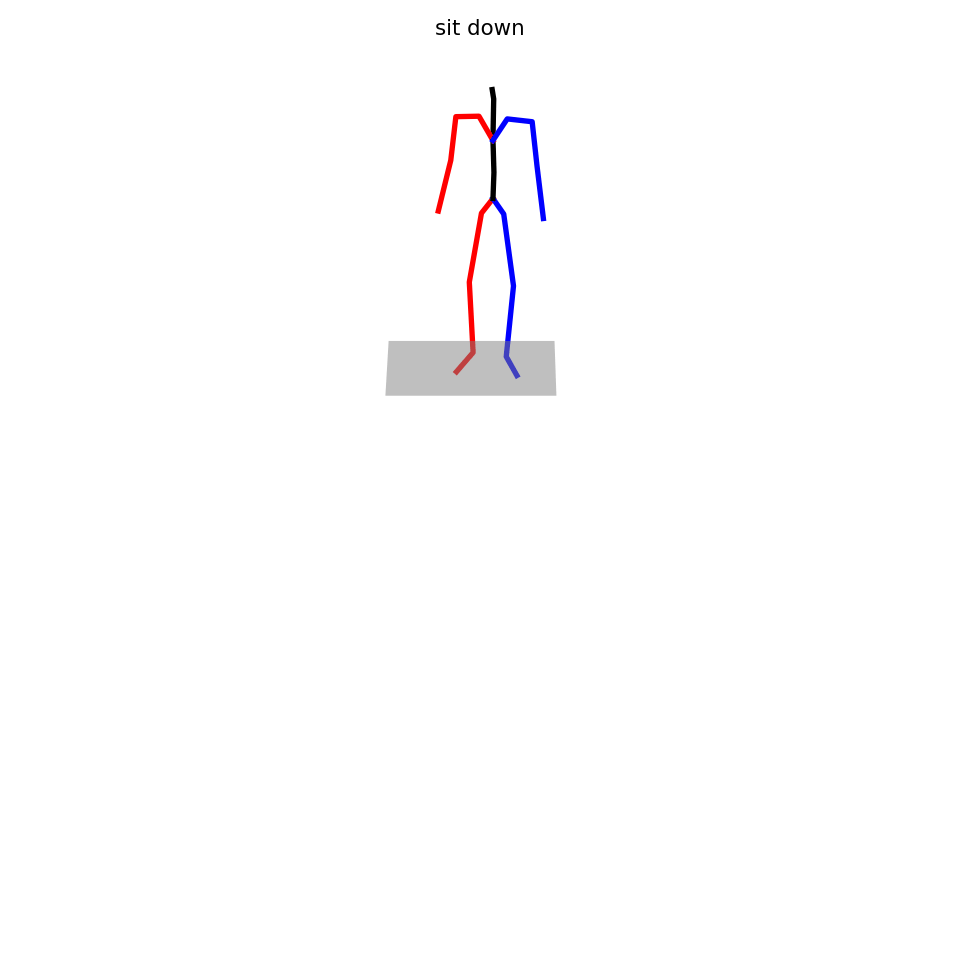 | 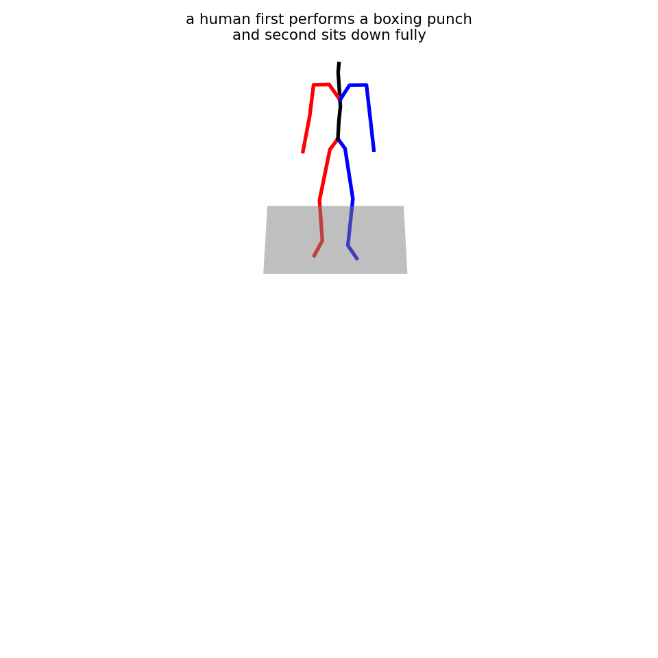 |  | 

<h3 align="center"> Motion Generated from Text Prompts. </h3> 
| A Human performing a boxing punch| A human sitting down | A human performing a boxing punch and then sitting down |
| ----------------------------------- | ----------------------------------- |
|  |  |

<h2 align="center">Section 2: Video Results For Method</h2>

<h3 align="center"> decoded motion of a sampled index sequence </h3> 

<h2 align="center">Section 3: Video Results For Experiments and Analysis</h2>
<h3 align="center"> Experiments with Bezier Curve </h3> 
| path of human walking forward| A human walking forward|
| ----------------------------------- | ----------------------------------- |
| 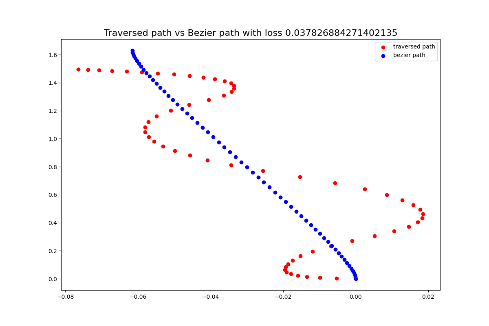 | 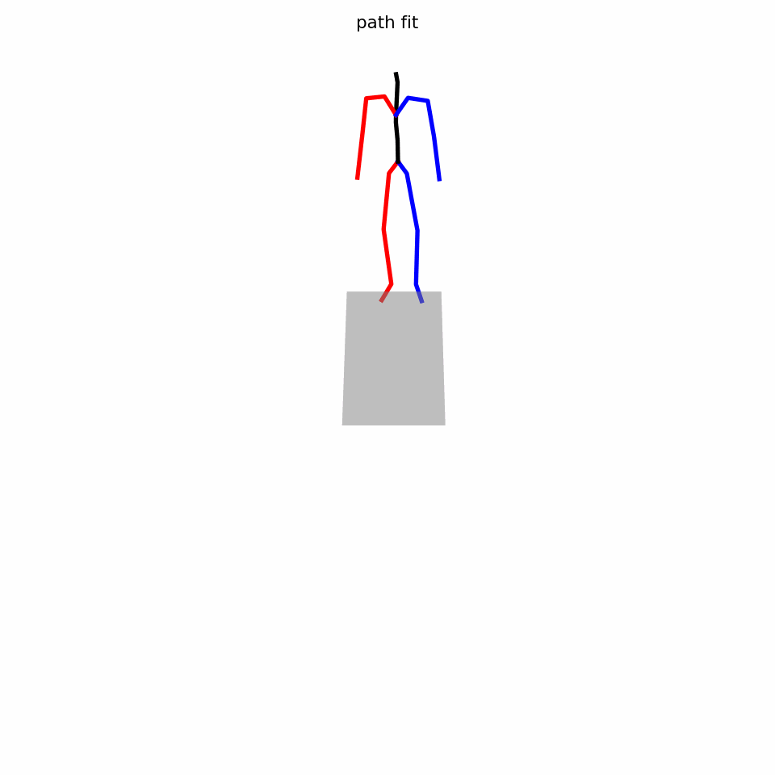 |
| ----------------------------------- | ----------------------------------- |
| path of human walking backward| A human walking backward|
| ----------------------------------- | ----------------------------------- |
| 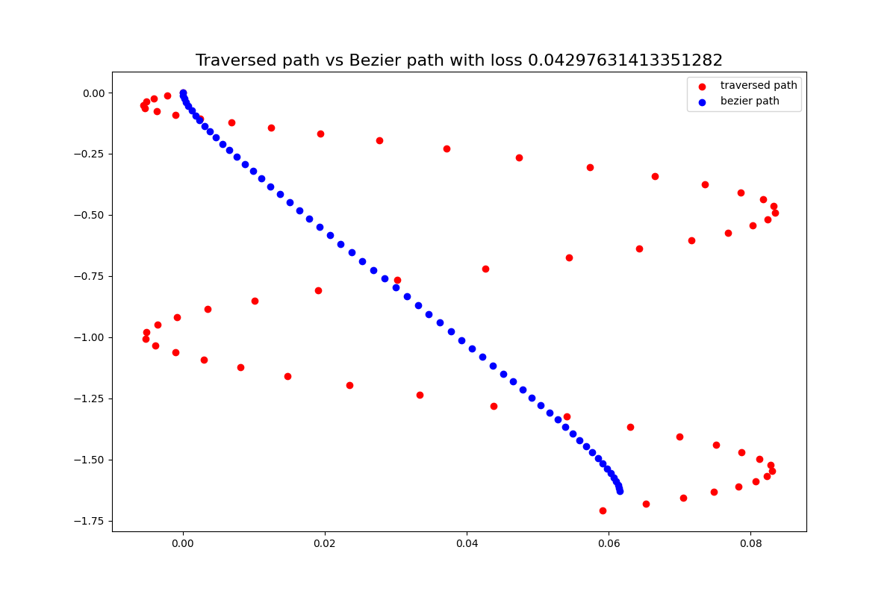 |  |
| ----------------------------------- | ----------------------------------- |
| path of human walking left| A human walking left|
| ----------------------------------- | ----------------------------------- |
| 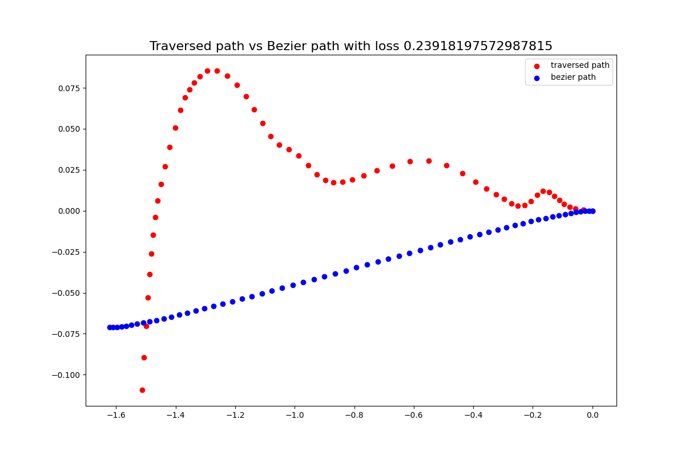 | 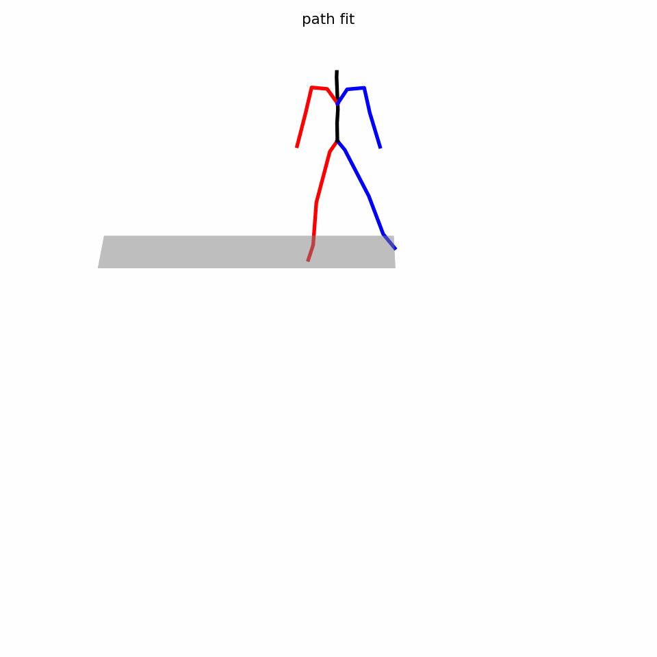 |
| ----------------------------------- | ----------------------------------- |
| path of human walking right| A human walking right|
| ----------------------------------- | ----------------------------------- |
|  | 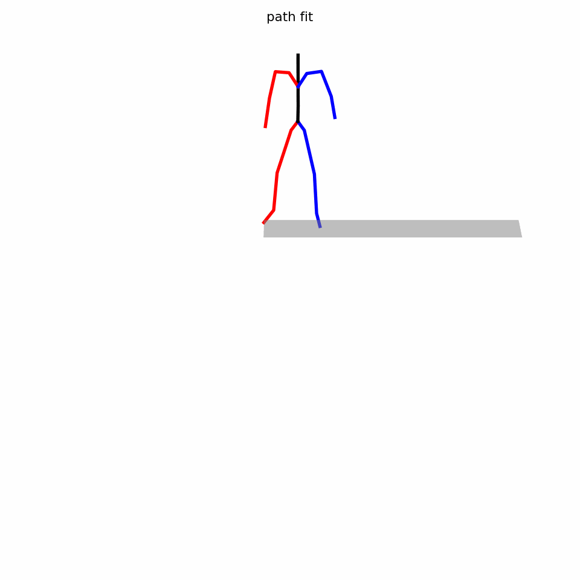 |
| ----------------------------------- | ----------------------------------- |
| path of human walking forward and then right| A human walking forward and then right|
| ----------------------------------- | ----------------------------------- |
| 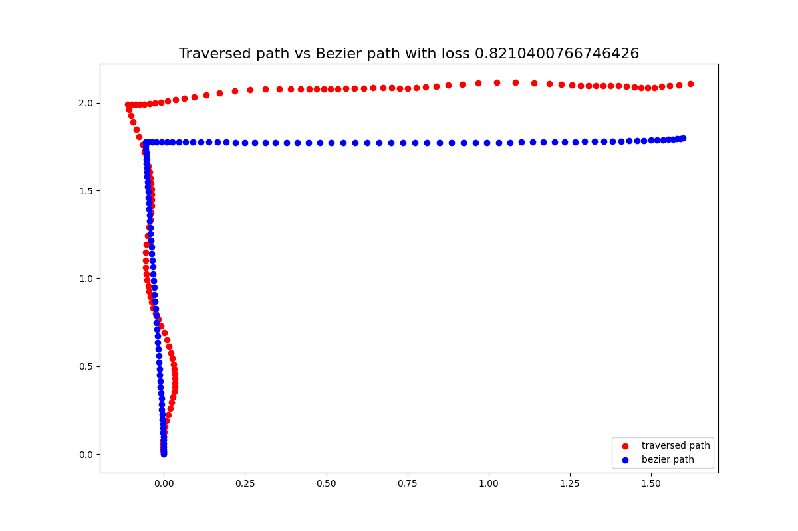 | 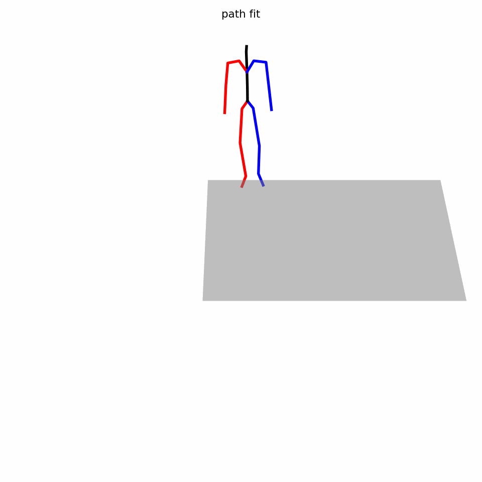 |
<h2 align="center">Section 2: Video Results For Results</h2>
