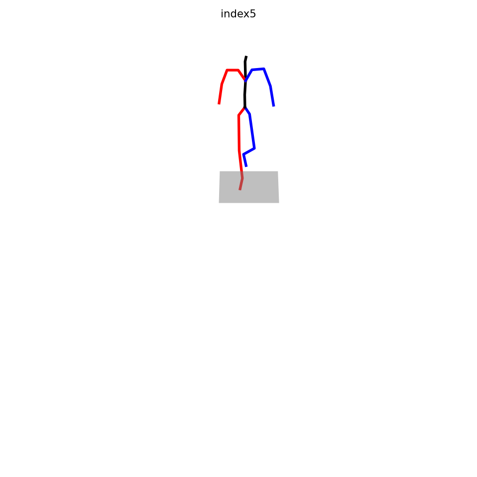
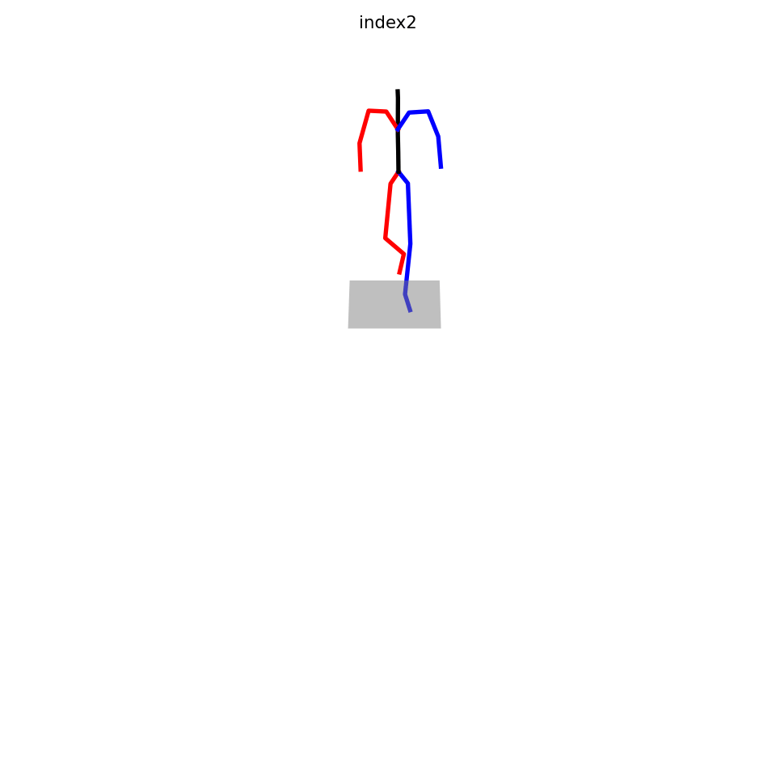

<h1 align="center">Q-MoGraph—Quantised Motion Graph</h1>

<h2 align="center">Section 1: Video Results For Introduction</h2>

  

    
    
<em>Fig:</em>taking a step forward with left leg 

  

  
  

    
    
<em>Subcaption:</em> taking a step forward with right leg

  

  
<strong>Fig:</strong> motion sub-actions.

<h2 align="center">Section 2: Video Results For Method</h2>

<h2 align="center">Section 3: Video Results For Experiments and Analysis</h2>

<h2 align="center">Section 2: Video Results For Results</h2>
